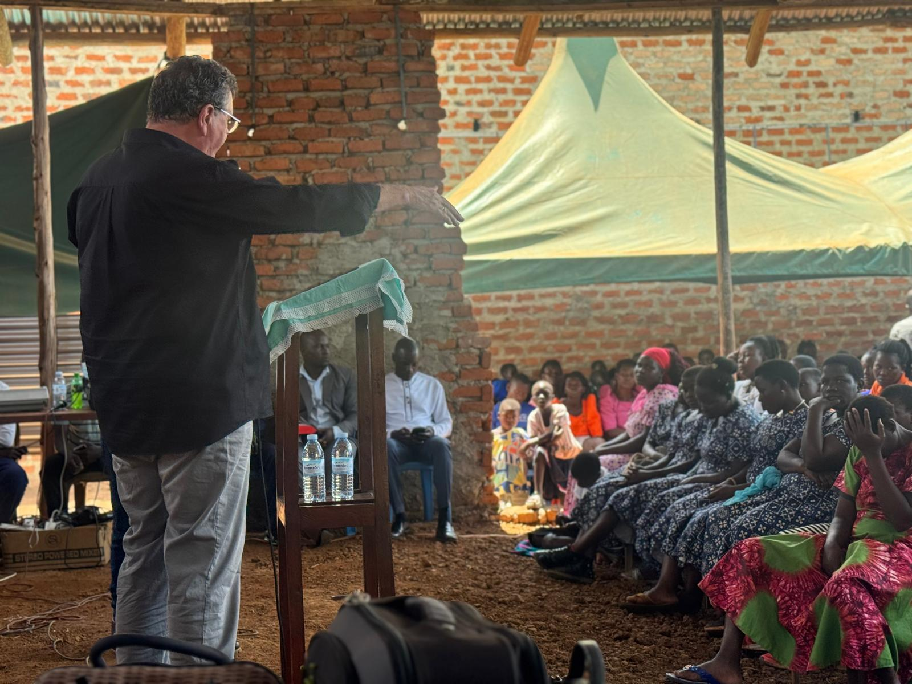
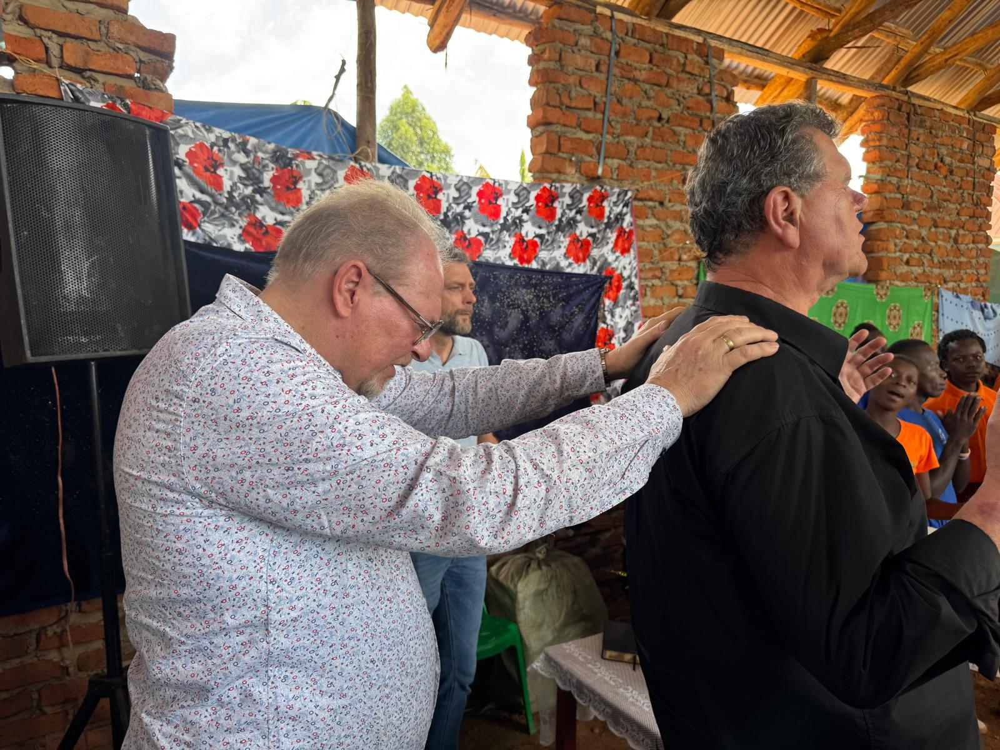
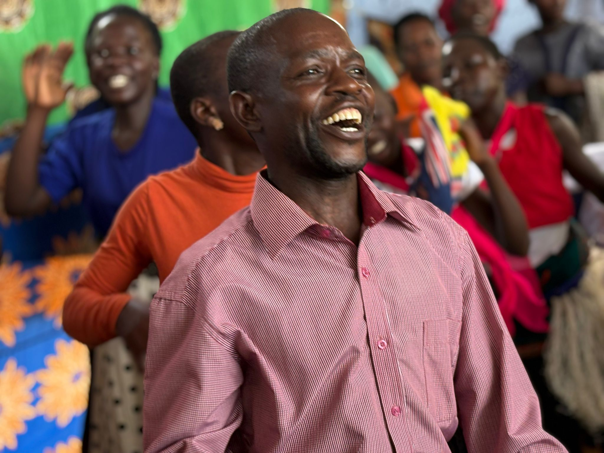
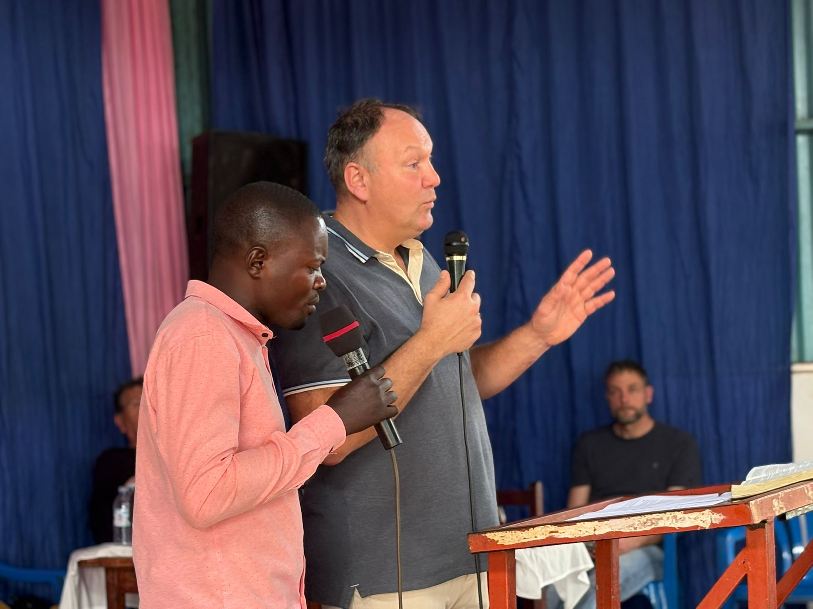
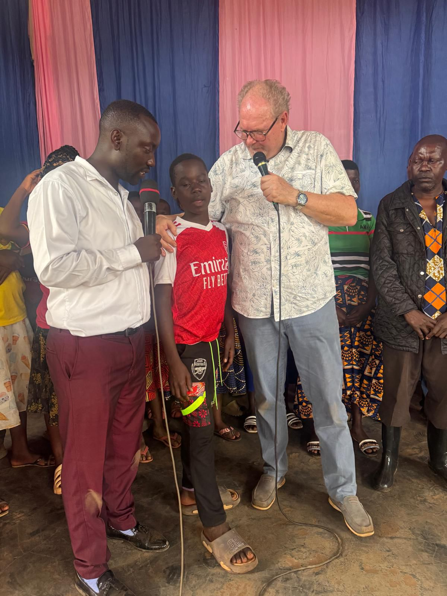
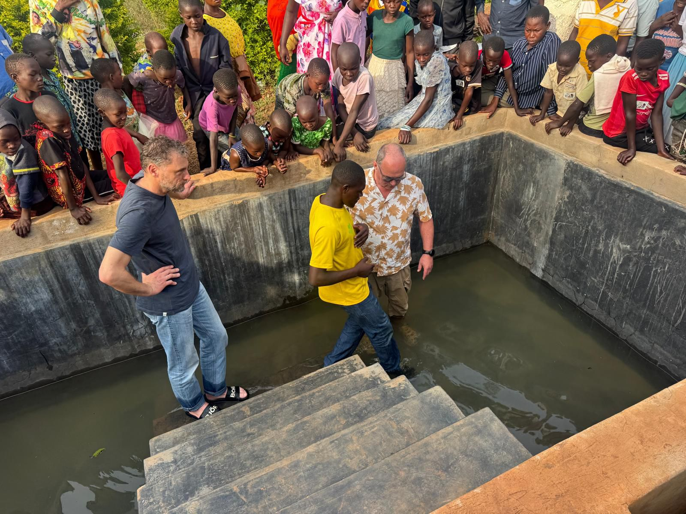
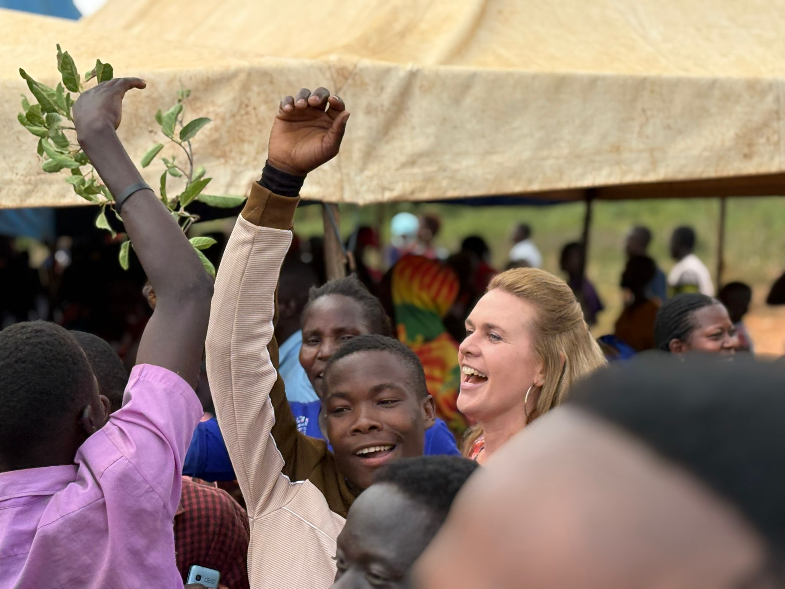
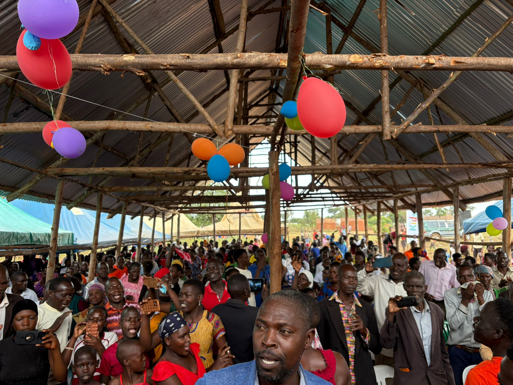

Vandaag was opnieuw een overweldigende en zegenrijke dag waarin Gods Koninkrijk zichtbaar baanbrak. De boodschappen werden met open harten ontvangen, en we beseften opnieuw hoe krachtig God Zijn gemeente heeft bestemd als een plaats waar Hij woont en werkt te midden van Zijn kinderen. Zijn liefde reikte uit naar zowel de jongste als de oudste.

De dag werd afgesloten met een feestelijke doopdienst. Verschillende gasten die waren komen kijken, gaven hun leven aan Jezus, een bijzonder moment van genade en nieuw begin.

Daarna zijn we naar twee nieuwe gebieden gegaan: **Berea**  en **Efeze** . Beide locaties waren volledig ingericht, en ook voor ons was het de eerste keer dat we daar dienden. We hebben gebeden tegen de machten van hekserij, dood en vernietiging, en God gevraagd om bescherming en doorbraken.

We zijn inmiddels terug van twee prachtige diensten waarin opnieuw veel is gebeurd. Ongeveer **75 mensen hebben hun leven aan Jezus gegeven** , en er vonden vele wonderen plaats. De getuigenissen daarvan zullen we nog ontvangen, maar de dankbaarheid is nu al groot.

We zijn moe, maar diep dankbaar voor alles wat God vandaag heeft gedaan. We gaan nu rusten en ons voorbereiden op de reisdag van morgen. Onze vlucht vertrekt pas veertig minuten na middernacht, dus het wordt een lange dag.

Hieronder delen we foto’s en video’s die een indruk geven van deze bijzondere dag.

We zegenen jullie met liefde en Gods nabijheid.

**Het Oeganda-team**

<video controls preload="none" playsinline src="/media/video/WhatsApp-Video-2026-02-08-at-16.27.46.mp4"></video>

<video controls preload="none" playsinline src="/media/video/WhatsApp-Video-2026-02-08-at-16.31.43.mp4"></video>
