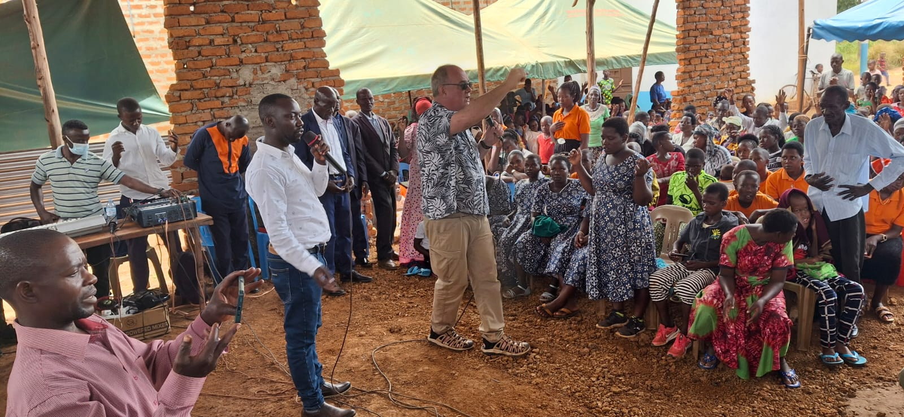
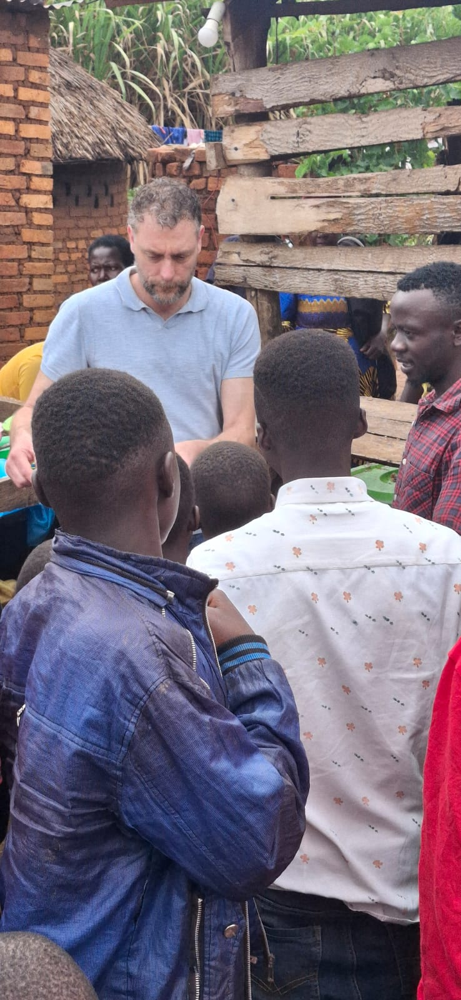
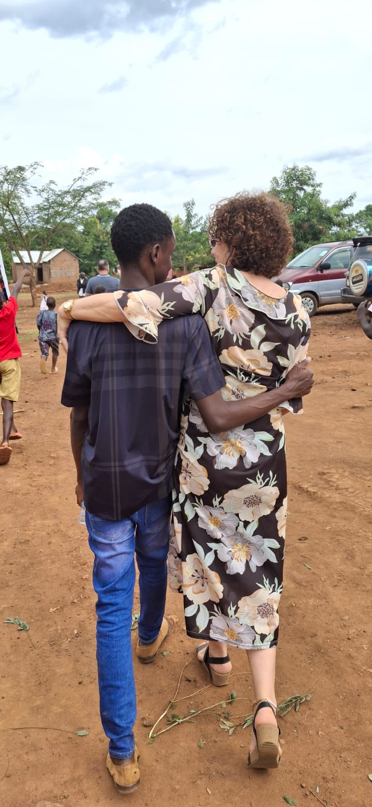
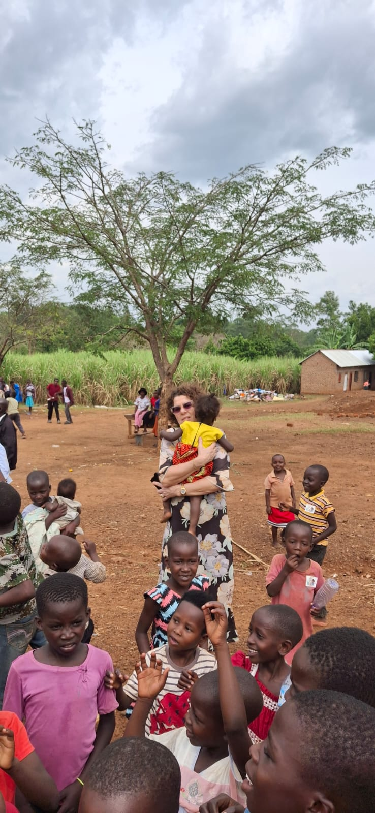
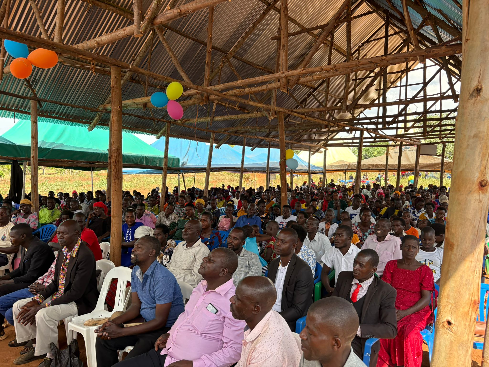

Wachtend in Entebbe op onze vlucht 0.40 uur horen we de eerste getuigenissen van gister Inmiddels zijn er 240 bekeerlingen en getuigenissen van honderden genezingen.

 Tevens werden gister en vandaag al ruim 500 mensen gedoopt, iets wat de komende maand in volle gang plaats gaat vinden.

We zijn stil en dankbaar wat er gebeurt als Gods Geest de ruimte krijgt In het opwekkings gebied zijn inmiddels zo’n 50 moskeeën leeg. Moslims hebben Jezus gevonden Hoe wrang om te zien dat in ons land juist moskeeën gebouwd worden en kerken sluiten Oh Here bezoek ons!

<video controls preload="none" playsinline src="/media/video/WhatsApp-Video-2026-02-09-at-06.34.20.mp4"></video>

<video controls preload="none" playsinline src="/media/video/WhatsApp-Video-2026-02-09-at-06.34.21.mp4"></video>

<video controls preload="none" playsinline src="/media/video/WhatsApp-Video-2026-02-09-at-06.34.23.mp4"></video>

<video controls preload="none" playsinline src="/media/video/WhatsApp-Video-2026-02-09-at-06.34.24.mp4"></video>
