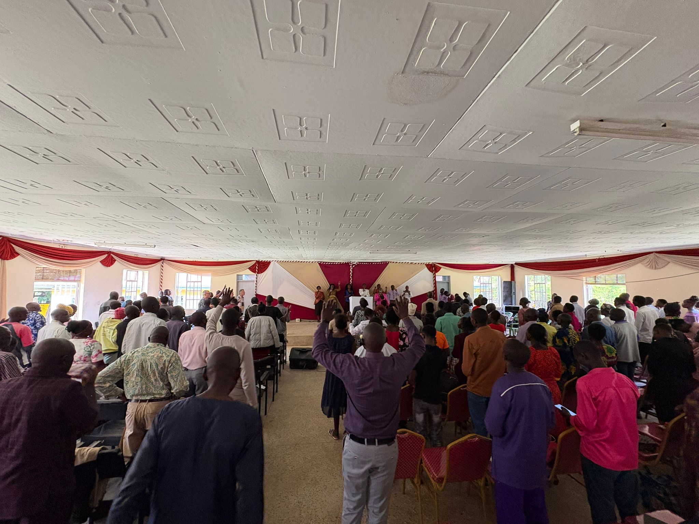
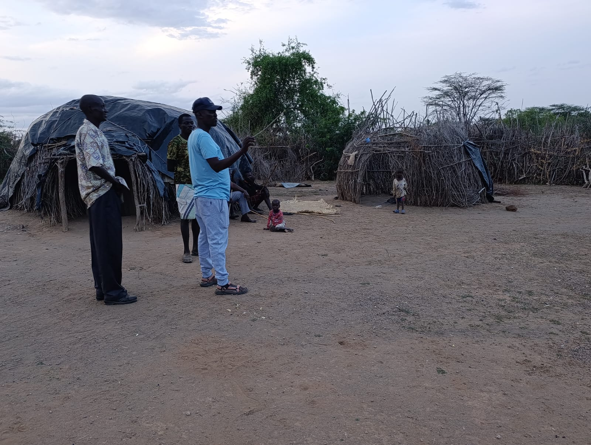

Op 26 januari start een nieuwe bijbelschool in het woestijngebied op de grens van Kenia en Sudan. Voor deze opleiding worden ruim 50 studenten uitgenodigd, waarvan de helft afkomstig is uit het grootste vluchtelingenkamp in Sudan.

Pastor John — een oud-student van onze bijbelschool in Webuye — heeft inmiddels zes gemeenten gesticht in Sudan (Kakuma vluchtelingenkamp) en achtentwintig gemeenten in het noordelijke grensgebied van Kenia (Turkana Land). Met zijn pioniershart en onze ondersteuning zet hij nu de volgende stap: de oprichting van een nieuw trainingscentrum voor toekomstige bedieningen.

<video controls preload="none" playsinline src="/media/video/WhatsApp-Video-2025-11-06-at-19.13.00.mp4"></video>

<video controls preload="none" playsinline src="/media/video/WhatsApp-Video-2025-11-06-at-19.15.26.mp4"></video>

Evangelisatie in het vluchtelingenkamp in Sudan
