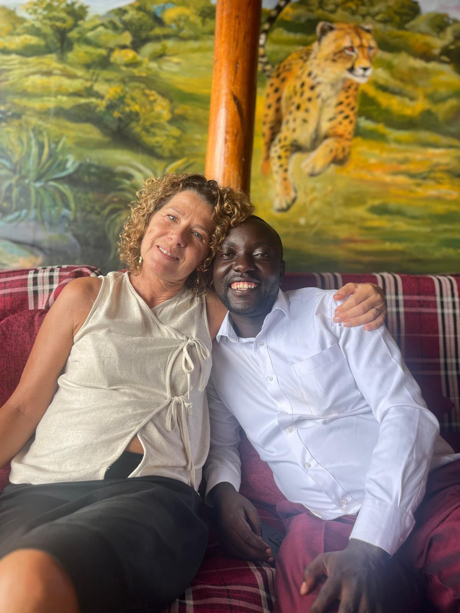
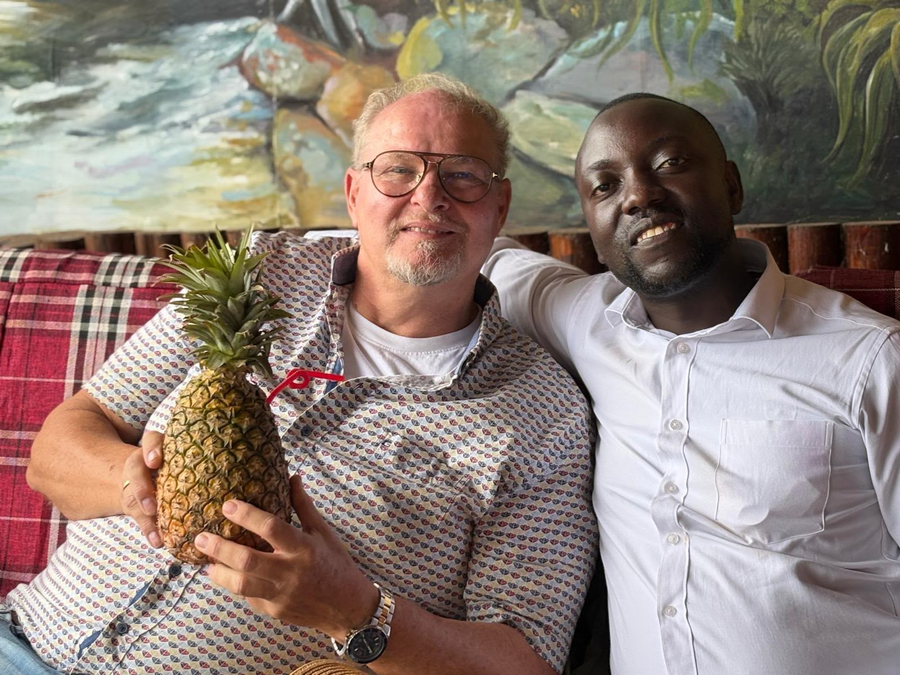
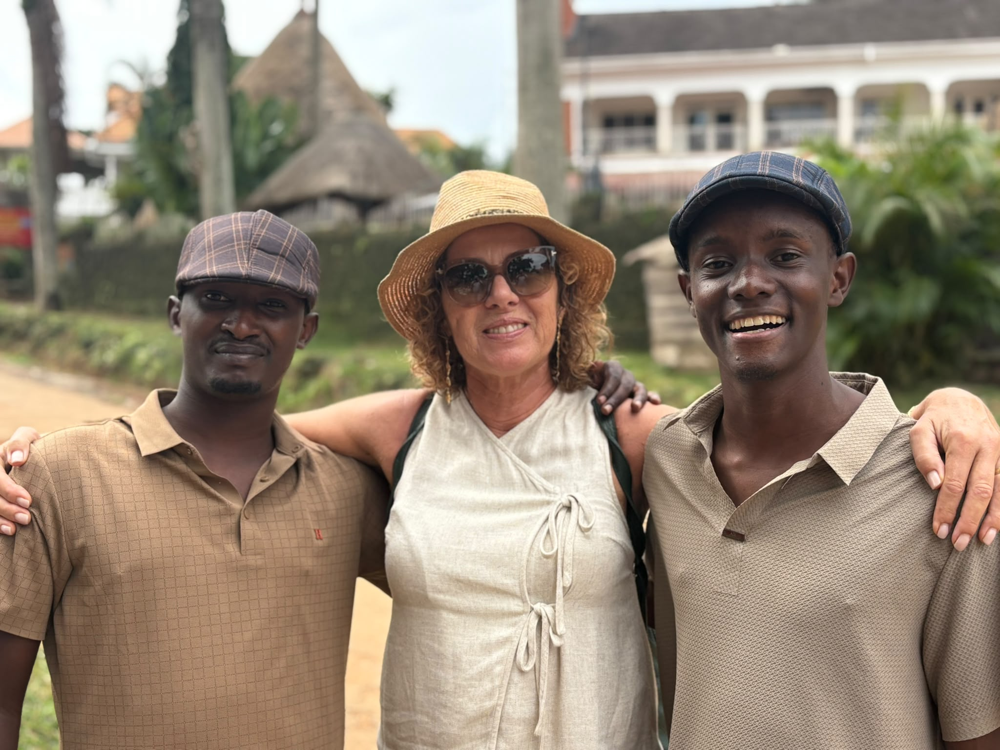
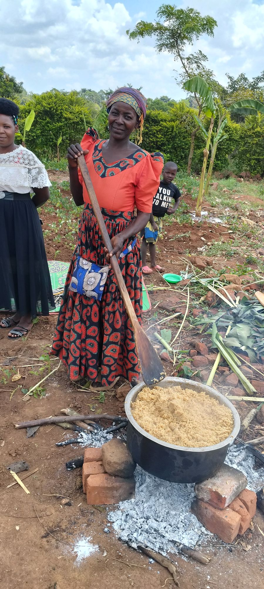
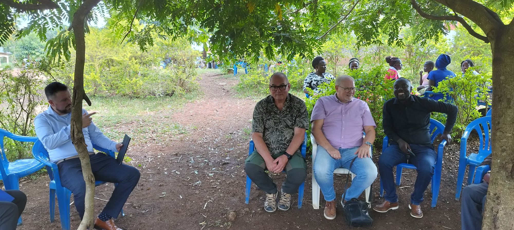
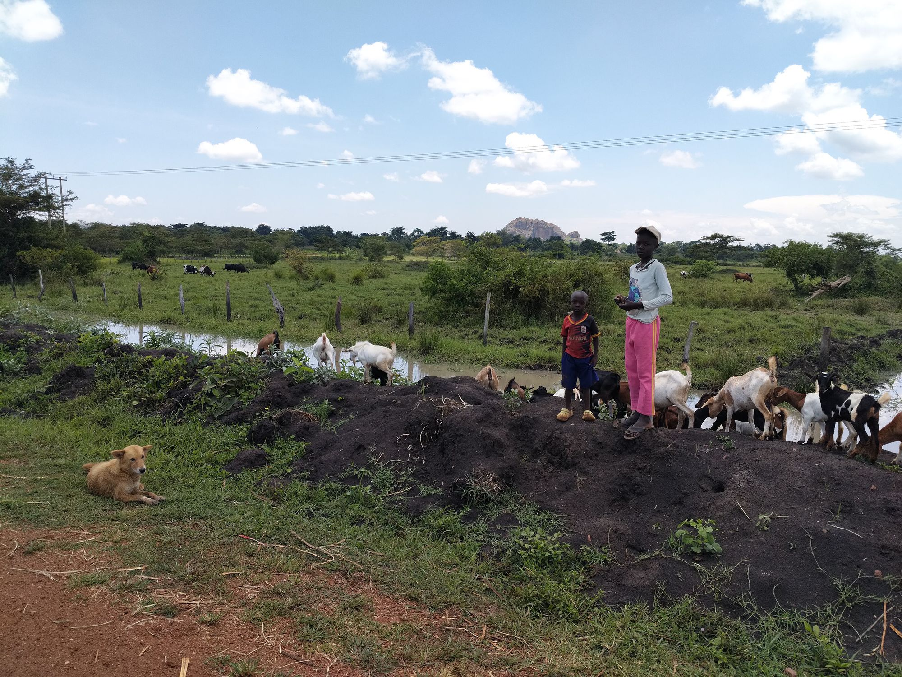
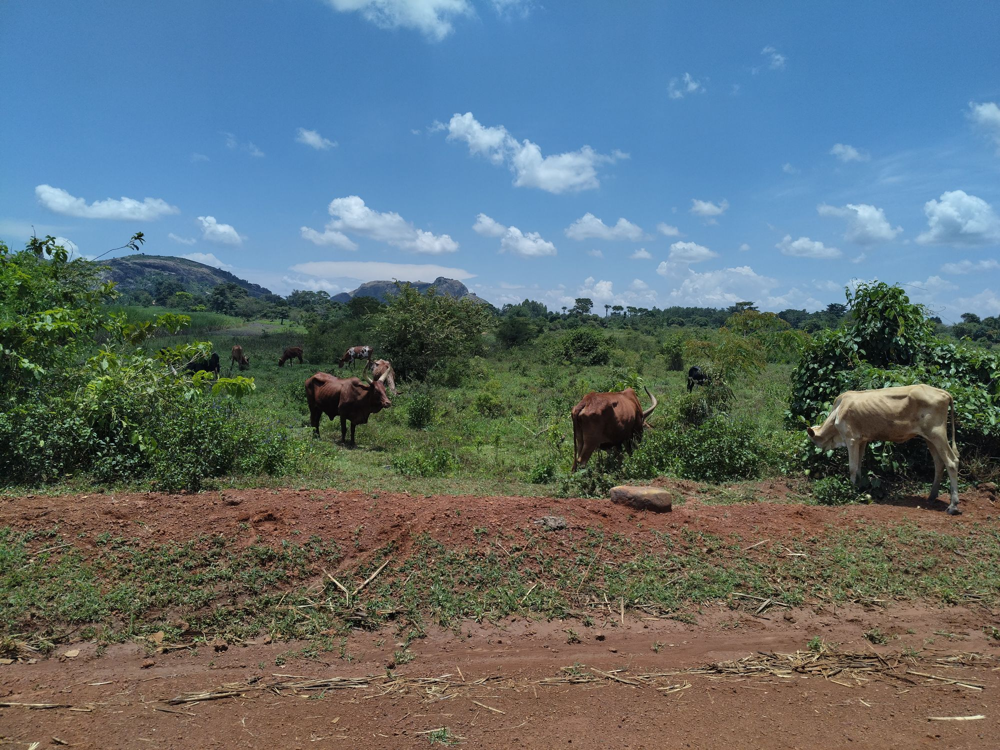
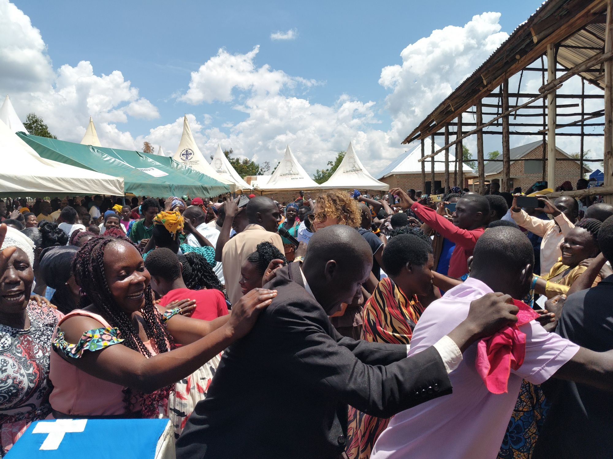

We kijken dankbaar terug op de dagen van onze missietrip naar Oeganda: dagen met een open hemel, waarin van alles gebeurde. Elke dienst en elk seminar was impactvol en de notitiebladen werden volgeschreven.

We zagen dat onderwijs een levensader is die voorkomt dat wildgroei en vermenging zich kunnen vestigen. De cultuur is zo anders en gewoonten zitten zo diep in de generaties dat alleen de Waarheid vanuit Gods Woord vrijmaakt.

Daarna reisden we naar de Philadelphia-gemeente, waar we een grote massameeting hielden. We hadden gevraagd om gebed voor een krachtige uitstorting van Gods Geest, voor bekeerlingen en vele dopelingen. De twee dagen die volgden waren gevuld met vergaderen, onderwijs, toerusting en dopen, met een levensveranderend effect.

Vervolgens reisden we naar een nieuwe celgroep. Naast de zeven gemeenten zijn er heel veel celgroepen, die klein beginnen en uitgroeien tot honderden gelovigen per cel. Er kwamen velen tot geloof; het was een kleinere herhaling van de zondag. Helaas was er geen water aanwezig; anders hadden we velen kunnen dopen. Hier ligt nog een enorme logistieke uitdaging vanwege de grote afstanden.

Onze lichamen werden maximaal belast en we zijn dankbaar voor de kracht die we ontvingen. De foto's geven een goede impressie van deze dagen.

Tot slot reisden we naar Entebbe. Om 21.00 uur vlogen we van Entebbe naar Nairobi en om 23.59 uur van Nairobi naar Amsterdam, waar we donderdag om 7.45 uur landden.

We zijn zeer dankbaar voor alle zichtbare zegeningen, en de rest volgt. Dank voor alle gebeden.

Een lieve groet van ons allen
