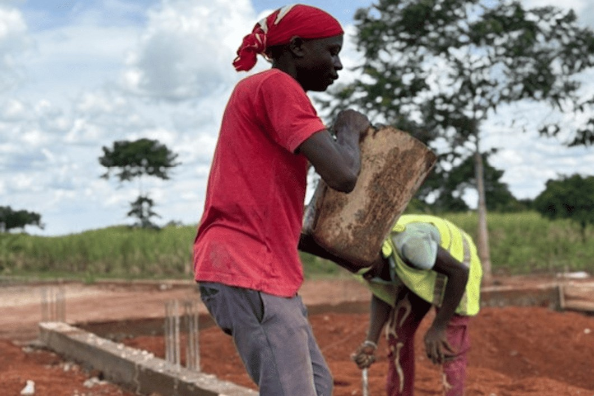
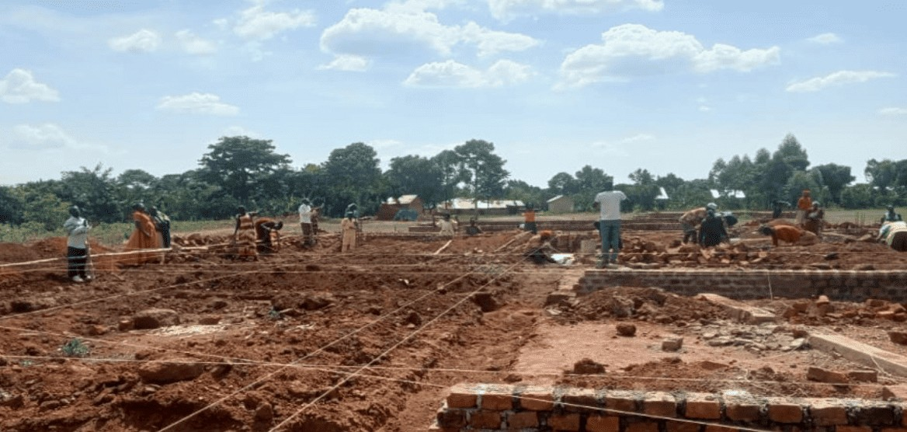
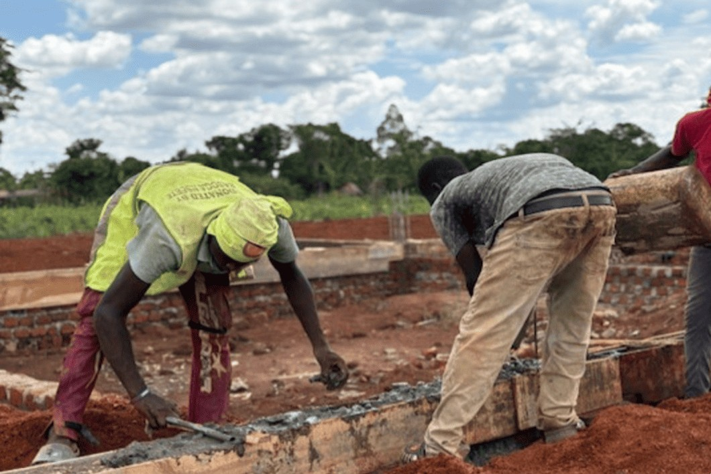

## Missie reis Oost Uganda

De missie reis Uganda was overweldigend en de impact enorm. In een korte tijd hebben we onder Gods genade heel veel kunnen doen. Het ministryteam bestaande uit de 70 werkers groeit en wordt steeds meer volwassen in hun takenpakket. Bonney woont nu in het opwekkingsgebied en bij hem zullen drie geestelijke zonen eveneens gehuisvest worden. Zo kan hij steeds meer delegeren en zich toeleggen op het leiden van dit megaproject ondersteund door Henry en Emma (de voorgangers van ‘Jeruzalem’ en ‘Samaria’).

De bouw van het fundament is in volle gang en beseffende dat dit alles ‘handwerk’ is, brengt ons bijna terug in het stenen tijdperk. Er is geen cementmolen, geen kruiwagen en geen slang die water aanvoert.

We hebben uitgebreid de verdere bouwplannen besproken en er staan drie geplande vervolgfases van elk € 30.000,-

- De eerste fase betreft de opbouw van muren en het plaatsen van deuren en vensters inclusief het toiletgebouw en slaapruimte voor de Bijbelschool studenten;
- De tweede fase betreft de bouw van de dakconstructie en het plaatsen van de daken met afwatering voorziening;
- De derde fase betreft de afbouw (stucwerk, schilderwerk en electra) alsook de oplevering (bestrating rondom).

Het multifunctionele gebouw zal ook worden gebruikt voor seminars over huwelijk, gezin, seksualiteit en kinderen, alsmede voor trainingen over onder andere: bevrijding, genezing, discipelschap en evangelisatie. Ook voor ‘pastor conferences’ biedt het immense mogelijkheden. Wij ervaren dat we steeds meer een goddelijk mandaat hebben gekregen in Oost-Uganda en dat willen we uitnutten zolang het kan.

Onze visie is dat in het nieuwe gebouw een groot scherm zal worden geplaatst en wij hier via een satellietverbinding duizenden gelovigen kunnen gaan trainen. Ook het vertonen van films zoals de film van Jezus zal de omgeving doen schudden op haar grondvesten. Vergeet niet dat het gebied vele honderden jaren onder hekserij heeft geleefd en het licht van het evangelie zich nu razendsnel verspreidt. De deur staat open, het is nu de (oogst)tijd.

## We zijn op zoek naar sponsors

We beseffen dat het neerzetten van zo’n multifunctioneel gebouw een geloofsstap inhoudt. We hebben echter geleerd vanuit Gods Woord om te gaan bewegen als God Zijn visie in onze harten plant. Tot nu toe heeft de Here machtig voorzien, de grond is eigendom, het fundament is bijna gereed gelegd en betaald en: ‘het volk heeft lust om te werken’.

We vragen jouw financiële steun en gebeds betrokkenheid, alsmede misschien een kanaal zijn naar sponsors en bedrijven. Er is een sponsorbrief beschikbaar, die op verzoek naar je gestuurd kan worden zodat jij de connectie zelf kunt leggen binnen jouw invloedssfeer.

Het krachtige woord uit het boek Nehemia wil ik als een belijdenis over dit project uitbidden: ‘De God des hemels, Hij zal het ons doen gelukken, en wij zijn knechten, zullen ons gereed maken en bouwen’ (Neh. 2:20)

We hebben in geloof de eerste stap gezet en dat bestaat uit het leggen van het fundament.

Blijf bidden en geven voor onze dochtergemeenten en dit megaproject.
